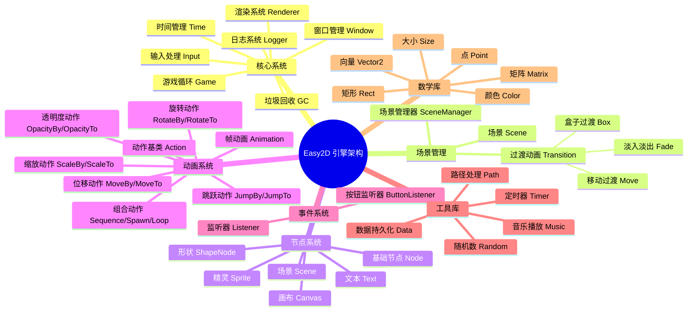
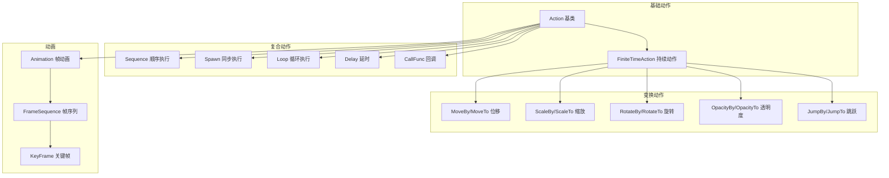
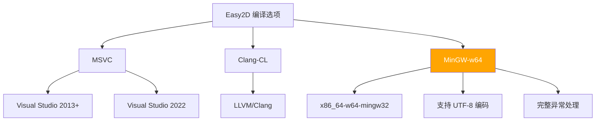
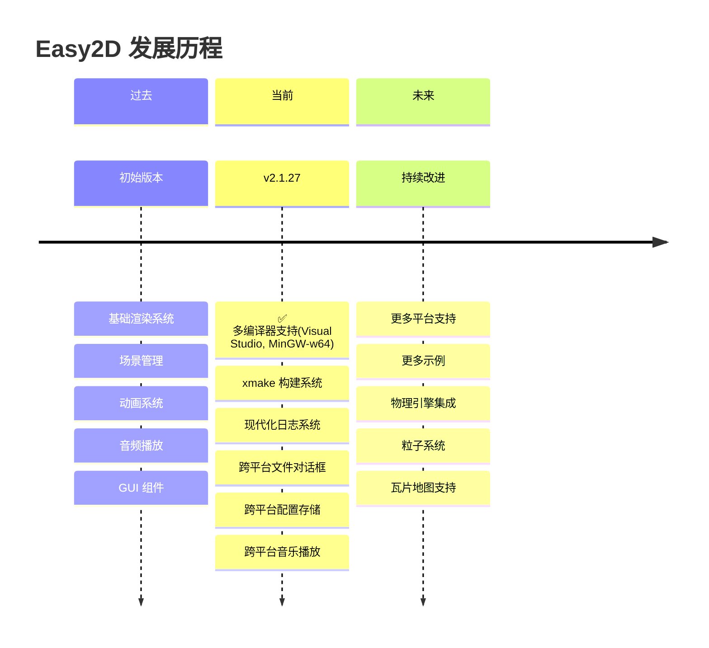

<div align="center">


<p align="center">
  <a href="https://github.com/Easy2D/Easy2D/releases/latest">
    
  </a>
  <a href="https://github.com/Easy2D/Easy2D/blob/master/LICENSE">
    
  </a>
  <a href="https://ci.appveyor.com/project/Nomango/easy2d/branch/master">
    
  </a>
  <a href="#">
    
  </a>
  <a href="#">
    
  </a>
  <a href="#">
    
  </a>
</p>

<p align="center">
  <b>🎮 为 C++ 打造的轻量级 2D 游戏引擎</b><br>
  <i>简单、高效、跨编译器支持</i>
</p>

[📖 官方文档](https://easy2d.cn) | [🚀 快速开始](#快速开始) | [📦 下载安装](#安装) | [💬 QQ群: 608406540](#联系方式)

</div>

---

## 🌟 简介

**Easy2D** 是一个专为 C++ 设计的轻量级 2D 游戏引擎，目前支持 Windows 平台。

> 💡 创建这个引擎的初衷是学习游戏引擎技术，并开发一些有趣的小游戏。Easy2D 提供了丰富的工具和轮子，让游戏开发变得简单而愉快。

---

## 🗺️ 架构概览



---

## ✨ 功能特性

### 🎬 核心功能

| 功能模块 | 描述 | 状态 |
|:--------:|:-----|:----:|
| 🎭 场景管理 | 灵活的场景切换与管理 | ✅ |
| 🎨 过渡动画 | 淡入淡出、移动、盒子等多种过渡效果 | ✅ |
| 🎬 动画系统 | 丰富的动作和帧动画支持 | ✅ |
| 🔘 GUI 系统 | 简单易用的按钮组件 | ✅ |
| 🎵 音频支持 | WAV 格式音频播放 | ✅ |
| 💾 数据持久化 | 游戏数据保存与读取 | ✅ |
| 📝 日志系统 | 基于 spdlog 的高性能日志 | ✅ |

### 🎯 动作系统详解



### 🖼️ 渲染流程


---

## 🚀 快速开始

### 环境要求

| 组件 | 最低版本 | 推荐版本 |
|:----:|:--------:|:--------:|
| Windows | Windows 7 | Windows 10/11 |
| Visual Studio | 2013 | 2022 |
| MinGW-w64 | 8.1.0 | 最新版 |
| C++ 标准 | C++11 | C++17 |

### 编译器支持



### 方式一：使用 Visual Studio

#### 步骤 1: 克隆仓库

```bash
git clone https://github.com/nomango/easy2d.git
cd easy2d
```

#### 步骤 2: 打开项目

使用 **Visual Studio 2013 或更高版本** 打开目录下的 `sln` 文件。

#### 步骤 3: 编译运行

直接运行项目，编译完成后会自动打开 Hello World 程序 🎉

### 方式二：使用 MinGW (🆕 新增支持)

#### 步骤 1: 安装依赖

确保已安装 [xmake](https://xmake.io) 构建工具：

```bash
# Windows 使用 PowerShell
Invoke-Expression (Invoke-Webrequest 'https://xmake.io/psget.text' -UseBasicParsing).Content
```

#### 步骤 2: 使用 MinGW 编译

```bash
# 克隆仓库
git clone https://github.com/nomango/easy2d.git
cd easy2d

# 使用 MinGW 工具链编译
xmake f --toolchain=mingw --mode=release
xmake

# 运行示例游戏
xmake run GreedyMonster
```

#### MinGW 编译选项说明

```bash
# 配置编译选项
xmake f --toolchain=mingw          # 使用 MinGW 工具链
xmake f --toolchain=msvc           # 使用 MSVC 工具链（默认）
xmake f --toolchain=clang-cl       # 使用 Clang-CL 工具链

# 切换构建模式
xmake f --mode=debug               # 调试模式
xmake f --mode=release             # 发布模式

# 清理并重新编译
xmake clean
xmake -r
```

### 方式三：使用 xmake (推荐)

```bash
# 使用默认工具链（自动检测）
xmake

# 运行游戏
xmake run GreedyMonster
```

---

## 📦 使用 xmake 远程包管理 Easy2D

xmake 提供了强大的远程包管理功能，可以轻松集成 Easy2D 到你的项目中，无需手动下载和配置。

### 基础配置

最简单的配置方式，适合快速开始：

```lua
-- xmake.lua
add_rules("mode.debug", "mode.release")

-- 添加 Easy2D 远程仓库
add_repositories("easy2d https://github.com/ChestnutYueyue/xmake-repo")

-- 添加 Easy2D 包依赖
add_requires("easy2d")

target("mygame")
    set_kind("binary")
    set_languages("c++17")
    add_files("src/*.cpp")
    add_packages("easy2d")
target_end()
```

### 进阶配置

#### 静态链接模式

如果你希望将 Easy2D 静态链接到你的可执行文件中：

```lua
-- xmake.lua
add_rules("mode.debug", "mode.release")
add_repositories("easy2d https://github.com/ChestnutYueyue/xmake-repo")

-- 配置为静态库链接
add_requires("easy2d", {configs = {shared = false}})

target("mygame")
    set_kind("binary")
    set_languages("c++17")
    add_files("src/*.cpp")
    add_packages("easy2d")
target_end()
```

#### Windows 平台完整配置

针对 Windows 平台的完整配置示例，包含编译器优化和系统库链接：

```lua
-- xmake.lua
add_rules("mode.debug", "mode.release")
add_repositories("easy2d https://github.com/ChestnutYueyue/xmake-repo")
add_requires("easy2d", {configs = {shared = false}})

target("mygame")
    set_kind("binary")
    set_languages("c++17")
    add_files("src/**.cpp")
    add_files("src/**.rc")  -- 资源文件
    add_packages("easy2d")

    -- Windows 平台配置
    if is_plat("windows") then
        -- 减少 Windows 头文件冗余
        add_defines("WIN32_LEAN_AND_MEAN", "NOMINMAX")

        -- 链接 Windows 系统库
        add_syslinks("user32", "gdi32", "shell32", "winmm",
                     "imm32", "version", "ole32", "comdlg32",
                     "dinput8", "d2d1", "dwrite", "dxguid")

        -- MSVC / Clang-CL 编译器配置
        local toolchain = get_config("toolchain") or "msvc"
        if toolchain == "msvc" or toolchain == "clang-cl" then
            add_cxxflags("/EHsc", "/Zc:__cplusplus", "/utf-8", {force = true})
            add_cxxflags("/wd4996", {force = true})

            if is_mode("debug") then
                set_runtimes("MDd")
                add_cxxflags("/Od", "/Zi", {force = true})
            else
                set_runtimes("MD")
                add_cxxflags("/O2", "/Ob2", {force = true})
                -- Release 模式隐藏控制台窗口
                add_ldflags("/SUBSYSTEM:WINDOWS", "/ENTRY:mainCRTStartup", {force = true})
            end
        end
    end
target_end()
```

#### MinGW 平台完整配置

使用 MinGW 编译时的完整配置：

```lua
-- xmake.lua
add_rules("mode.debug", "mode.release")
add_repositories("easy2d https://github.com/ChestnutYueyue/xmake-repo")
add_requires("easy2d", {configs = {shared = false}})

target("mygame")
    set_kind("binary")
    set_languages("c++17")
    add_files("src/**.cpp")
    add_packages("easy2d")

    -- MinGW 平台配置
    if is_plat("mingw") then
        -- 编译警告选项
        add_cxxflags("-Wall", "-Wextra", "-Wpedantic", {force = true})
        add_cxxflags("-Wno-unused-parameter", "-Wno-missing-field-initializers", {force = true})

        -- UTF-8 编码支持
        add_cxxflags("-finput-charset=UTF-8", "-fexec-charset=UTF-8", {force = true})

        -- 启用异常处理和 RTTI
        add_cxxflags("-fexceptions", "-frtti", {force = true})

        -- 按模式配置
        if is_mode("debug") then
            add_cxxflags("-O0", "-g", "-ggdb", {force = true})
            set_runtimes("MDd")
        else
            add_cxxflags("-O2", "-fomit-frame-pointer", {force = true})
            add_ldflags("-mwindows", {force = true})
            set_runtimes("MD")
        end
    end
target_end()
```

### 多平台通用配置

一个同时支持 Windows (MSVC/MinGW) 的完整配置模板：

```lua
-- xmake.lua
add_rules("mode.debug", "mode.release")
add_repositories("easy2d https://github.com/ChestnutYueyue/xmake-repo")
add_requires("easy2d", {configs = {shared = false}})

target("mygame")
    set_kind("binary")
    set_languages("c++17")
    add_files("src/**.cpp")
    add_files("src/**.rc")
    add_packages("easy2d")

    -- ==============================================
    -- Windows 平台配置
    -- ==============================================
    if is_plat("windows") then
        add_defines("WIN32_LEAN_AND_MEAN", "NOMINMAX")

        local win_sys_libs = {
            "user32", "gdi32", "shell32", "winmm",
            "imm32", "version", "ole32", "comdlg32",
            "dinput8", "d2d1", "dwrite", "dxguid"
        }
        add_syslinks(win_sys_libs)

        local toolchain = get_config("toolchain") or "msvc"
        if toolchain == "msvc" or toolchain == "clang-cl" then
            add_cxxflags("/EHsc", "/Zc:__cplusplus", "/utf-8", {force = true})
            add_cxxflags("/wd4996", {force = true})

            if is_mode("debug") then
                set_runtimes("MDd")
                add_cxxflags("/Od", "/Zi", {force = true})
            else
                set_runtimes("MD")
                add_cxxflags("/O2", "/Ob2", {force = true})
                add_ldflags("/SUBSYSTEM:WINDOWS", "/ENTRY:mainCRTStartup", {force = true})
            end
        end
    end

    -- ==============================================
    -- MinGW 平台配置
    -- ==============================================
    if is_plat("mingw") then
        add_cxxflags("-Wall", "-Wextra", "-Wpedantic", {force = true})
        add_cxxflags("-Wno-unused-parameter", "-Wno-missing-field-initializers", {force = true})
        add_cxxflags("-finput-charset=UTF-8", "-fexec-charset=UTF-8", {force = true})
        add_cxxflags("-fexceptions", "-frtti", {force = true})

        if is_mode("debug") then
            add_cxxflags("-O0", "-g", "-ggdb", {force = true})
            set_runtimes("MDd")
        else
            add_cxxflags("-O2", "-fomit-frame-pointer", {force = true})
            add_ldflags("-mwindows", {force = true})
            set_runtimes("MD")
        end
    end
target_end()
```

### 构建命令

配置好 `xmake.lua` 后，使用以下命令构建项目：

```bash
# 配置项目（自动下载并安装 Easy2D 包）
xmake f --mode=release

# 使用 MinGW 工具链
xmake f --toolchain=mingw --mode=release

# 编译项目
xmake

# 运行程序
xmake run

# 清理构建
xmake clean

# 重新编译
xmake -r
```

### 项目目录结构示例

```
mygame/
├── xmake.lua          # xmake 配置文件
├── src/
│   ├── main.cpp       # 主程序入口
│   └── resources.rc   # Windows 资源文件（可选）
└── assets/            # 游戏资源文件
    ├── images/
    └── sounds/
```

---

## 📦 安装

### 简易安装器

简易安装器是一个使用 7zip 制作的自解压安装包，包含各 Visual Studio 版本预先编译好的库文件。

👉 前往 [GitHub Releases](https://github.com/Easy2D/Easy2D/releases/latest) 或 [Easy2D 官网](https://easy2d.cn) 下载最新安装程序。

### 从源代码安装

#### Visual Studio 项目配置

1. 编译 Easy2D 工程，生成 `.lib` 文件到 `/Easy2D/output/` 目录
2. 在你的项目中设置：
   - **C/C++** → **附加包含目录**: `$(Easy2DPath)/Easy2D/include/`
   - **链接器** → **附加库目录**: `$(Easy2DPath)/Easy2D/output/`

#### MinGW 项目配置

```makefile
# Makefile 示例
CXX = g++
CXXFLAGS = -std=c++17 -I/path/to/easy2d/Easy2D/include
LDFLAGS = -L/path/to/easy2d/build -leasy2d \
          -lopengl32 -luser32 -lgdi32 -lshell32 \
          -lwinmm -limm32 -lversion -lole32 \
          -lcomdlg32 -ldinput8 -ld2d1 -ldwrite -ldxguid

mygame: main.cpp
    $(CXX) $(CXXFLAGS) -o $@ $< $(LDFLAGS)
```

---

## 📝 Hello World 示例

```cpp
#include <easy2d/easy2d.h>

using namespace easy2d;

int main()
{
    // 初始化游戏窗口
    if (Game::init("Hello Easy2D", 800, 600))
    {
        // 创建场景
        auto scene = new Scene;
        
        // 创建文本节点
        auto text = new Text("Hello, Easy2D!");
        text->setPos(400, 300);
        text->setAnchor(0.5f, 0.5f);
        text->setFillColor(Color::Orange);
        
        // 添加动画效果
        text->runAction(new Loop(
            new Sequence({
                new ScaleTo(1.0f, 1.5f),
                new ScaleTo(1.0f, 1.0f)
            })
        ));
        
        // 添加到场景
        scene->addChild(text);
        
        // 启动场景
        SceneManager::enter(scene);
        
        // 开始游戏循环
        Game::start(60);  // 60 FPS
    }
    
    Game::destroy();
    return 0;
}
```

---

## 🏗️ 项目结构

```
Easy2D/
├── 📁 Easy2D/                    # 引擎核心代码
│   ├── 📁 include/               # 头文件
│   │   ├── 📁 easy2d/            # 引擎头文件
│   │   │   ├── easy2d.h          # 主头文件
│   │   │   ├── e2daction.h       # 动作系统
│   │   │   ├── e2dbase.h         # 基础系统
│   │   │   ├── e2dnode.h         # 节点系统
│   │   │   ├── e2dcommon.h       # 通用工具
│   │   │   ├── e2dmath.h         # 数学库
│   │   │   ├── e2dtool.h         # 工具库
│   │   │   └── ...
│   │   └── 📁 spdlog/            # 日志库
│   └── 📁 src/                   # 源文件
│       ├── 📁 Action/            # 动作系统实现
│       ├── 📁 Base/              # 基础系统实现
│       ├── 📁 Node/              # 节点系统实现
│       ├── 📁 Manager/           # 管理器实现
│       ├── 📁 Math/              # 数学库实现
│       ├── 📁 Tool/              # 工具库实现
│       └── 📁 Transition/        # 过渡动画实现
├── 📁 logo/                      # Logo 资源
├── 📁 scripts/                   # 构建脚本
├── 📄 xmake.lua                  # xmake 构建配置
├── 📄 LICENSE                    # MIT 许可证
└── 📄 README.md                  # 本文件
```

---

## 🛠️ 技术栈

| 技术 | 用途 | 版本 |
|:----:|:-----|:----:|
| Direct2D | 2D 图形渲染 | Windows SDK |
| DirectWrite | 文本渲染 | Windows SDK |
| DirectInput | 输入处理 | 8.0 |
| miniaudio | 音频播放 | 最新版 |
| spdlog | 日志系统 | 最新版 |
| xmake | 构建系统 | 2.5+ |

---

## 📋 API 速查

### 游戏控制

| 方法 | 说明 |
|:-----|:-----|
| `Game::init(title, w, h)` | 初始化游戏 |
| `Game::start(fps)` | 启动游戏循环 |
| `Game::pause()` | 暂停游戏 |
| `Game::resume()` | 恢复游戏 |
| `Game::quit()` | 退出游戏 |

### 场景管理

| 方法 | 说明 |
|:-----|:-----|
| `SceneManager::enter(scene)` | 进入场景 |
| `SceneManager::replace(scene)` | 替换场景 |
| `SceneManager::back()` | 返回上一场景 |

### 节点操作

| 方法 | 说明 |
|:-----|:-----|
| `node->setPos(x, y)` | 设置位置 |
| `node->setScale(sx, sy)` | 设置缩放 |
| `node->setRotation(angle)` | 设置旋转 |
| `node->setOpacity(value)` | 设置透明度 |
| `node->runAction(action)` | 运行动作 |

### 字符串编码转换

Easy2D 提供了便捷的字符串编码转换工具函数，支持 UTF-8、ANSI 和宽字符之间的相互转换。

#### 类型定义

```cpp
using ByteString = std::string;   // UTF-8/ANSI 字符串
using WideString = std::wstring;  // 宽字符串
using String = ByteString;        // 默认字符串类型（UTF-8）
```

#### 转换函数

| 函数 | 功能 | 示例 |
|:-----|:-----|:-----|
| `WideToNarrow(wstr)` | 宽字符串 → UTF-8 | `ByteString utf8 = WideToNarrow(L"中文");` |
| `NarrowToWide(str)` | UTF-8 → 宽字符串 | `WideString wide = NarrowToWide(utf8Str);` |
| `AnsiToUtf8(str)` | **ANSI → UTF-8** | `ByteString utf8 = AnsiToUtf8(gbkStr);` |
| `Utf8ToAnsi(str)` | **UTF-8 → ANSI** | `ByteString ansi = Utf8ToAnsi(utf8Str);` |
| `AnsiToWide(str)` | **ANSI → 宽字符串** | `WideString wide = AnsiToWide(gbkStr);` |
| `WideToAnsi(wstr)` | **宽字符串 → ANSI** | `ByteString ansi = WideToAnsi(L"中文");` |

#### 使用示例

```cpp
#include <easy2d/easy2d.h>

using namespace easy2d;

void stringExample()
{
    // ========== ANSI 与 UTF-8 转换 ==========
    // 从 GBK/ANSI 编码的文件读取内容后转换为 UTF-8
    ByteString gbkContent = "中文字符串";  // 假设这是 GBK 编码
    ByteString utf8Content = AnsiToUtf8(gbkContent);
    
    // 将 UTF-8 字符串转换为 ANSI 用于旧版 API
    ByteString ansiContent = Utf8ToAnsi(utf8Content);
    
    // ========== 宽字符转换 ==========
    // ANSI 转宽字符串（用于 Windows API）
    WideString wideStr = AnsiToWide(gbkContent);
    
    // 宽字符串转 ANSI
    ByteString ansiFromWide = WideToAnsi(wideStr);
    
    // ========== 在 Text 节点中使用 ==========
    // 如果文本文件是 GBK 编码，需要转换后显示
    auto text = new Text(AnsiToUtf8(gbkContent));
    text->setPos(400, 300);
    
    // ========== 格式化字符串 ==========
    ByteString formatted = FormatString("Score: %d", 100);
    WideString wideFormatted = FormatString(L"得分: %d", 100);
}
```

#### 注意事项

- **Windows 中文系统**：默认 ANSI 代码页为 GBK (936)
- **空字符串处理**：所有转换函数对空字符串返回空字符串，不会出错
- **转换失败**：如果转换失败，返回空字符串
- **内部实现**：基于 Windows API `MultiByteToWideChar` 和 `WideCharToMultiByte`

---

## 🗓️ 开发计划
### 路线图



## 🤝 贡献指南

欢迎提交 Issue 和 Pull Request！

1. Fork 本仓库
2. 创建特性分支 (`git checkout -b feature/AmazingFeature`)
3. 提交更改 (`git commit -m 'Add some AmazingFeature'`)
4. 推送到分支 (`git push origin feature/AmazingFeature`)
5. 打开 Pull Request

---

## 📞 联系方式

<div align="center">

| 渠道 | 链接 |
|:----:|:-----|
| 🌐 官网 | [easy2d.cn](https://easy2d.cn) |
| 💬 QQ群 | 608406540 |
| 🐙 GitHub | [github.com/Easy2D/Easy2D](https://github.com/Easy2D/Easy2D) |
| 📧 作者 | [Kiwano 引擎](https://github.com/nomango/kiwano) |

</div>

---

## 📄 许可证

本项目基于 [MIT](LICENSE) 许可证开源。

```
MIT License

Copyright (c) 2020 Haibo

Permission is hereby granted, free of charge, to any person obtaining a copy
of this software and associated documentation files (the "Software"), to deal
in the Software without restriction, including without limitation the rights
to use, copy, modify, merge, publish, distribute, sublicense, and/or sell
copies of the Software, and to permit persons to whom the Software is
furnished to do so, subject to the following conditions:

The above copyright notice and this permission notice shall be included in all
copies or substantial portions of the Software.
```

---

<div align="center">

**⭐ 如果这个项目对你有帮助，请给它一个 Star！**

Made with ❤️ by [Nomango](https://github.com/nomango)

</div>
