<div align="center">


[](https://ci.appveyor.com/project/Nomango/easy2d/branch/master)
[](https://github.com/Easy2D/Easy2D/releases/latest)
[](https://github.com/Easy2D/Easy2D/blob/master/LICENSE)

</div>

---

## 📖 简介

> 🎮 **Easy2D** 是一个为 C++ 设计的轻量级 2D 游戏引擎，专注于简化游戏开发流程，让开发者能够快速构建 Windows 平台的 2D 游戏。

### 🎯 设计目标

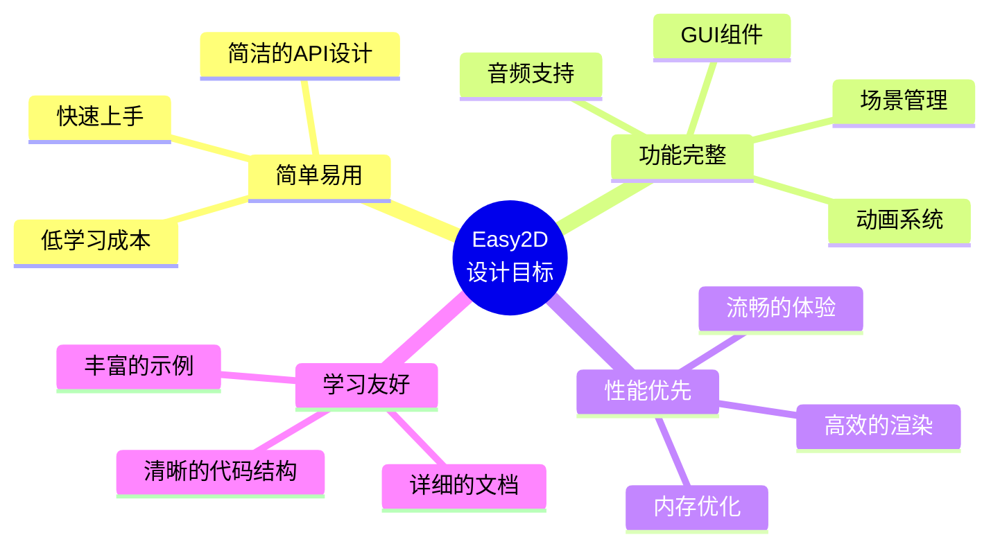

---

## 🏗️ 系统架构

### 核心架构图

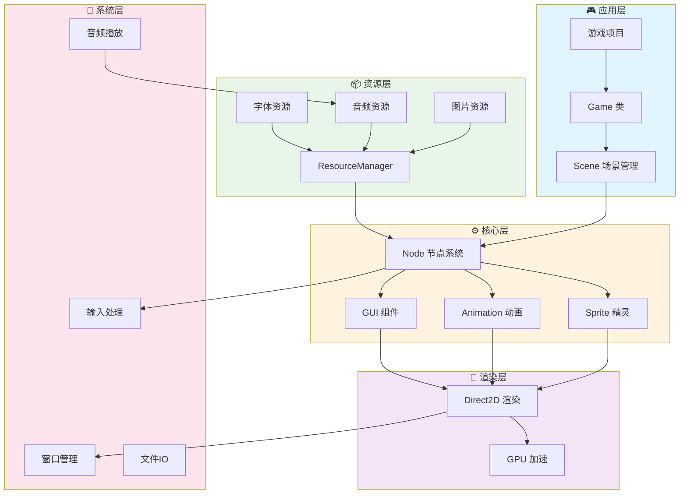

### 场景生命周期

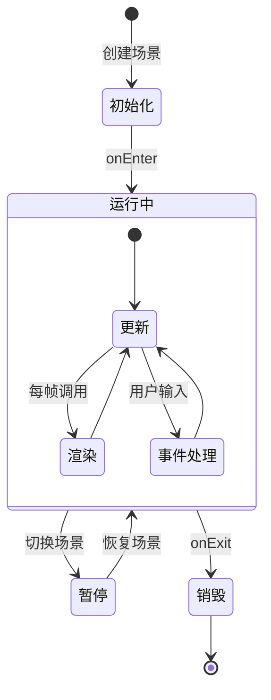

---

## ✨ 功能特性

### 功能全景图

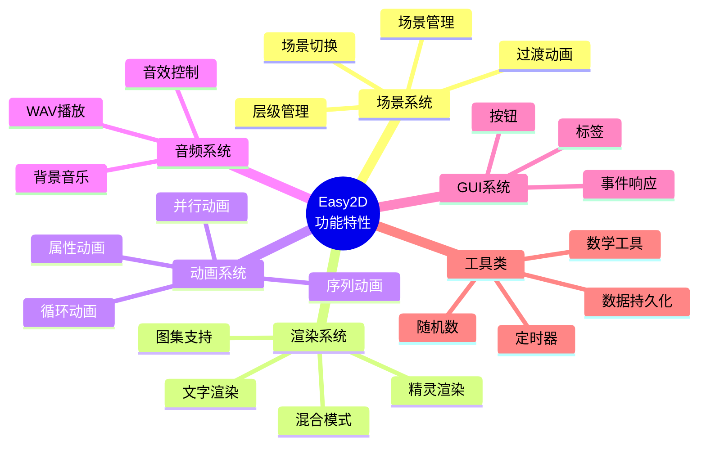

### 核心模块详解

| 模块 | 功能描述 | 关键类 |
|:---:|:---|:---|
| 🎬 **场景管理** | 多场景切换、过渡动画、层级控制 | `Scene`, `Director`, `Transition` |
| 🎨 **渲染系统** | 2D图形渲染、文字显示、纹理管理 | `Sprite`, `Label`, `Texture` |
| 🎭 **动画系统** | 属性动画、组合动画、缓动函数 | `Action`, `Animate`, `Ease` |
| 🔊 **音频系统** | WAV音频播放、音量控制 | `Audio`, `Music`, `SoundEffect` |
| 🖱️ **GUI系统** | 按钮、菜单、事件响应 | `Button`, `Menu`, `EventListener` |
| 💾 **数据存储** | 本地数据持久化、配置文件 | `UserDefault`, `FileUtils` |

---

## 🚀 快速开始

### 环境要求

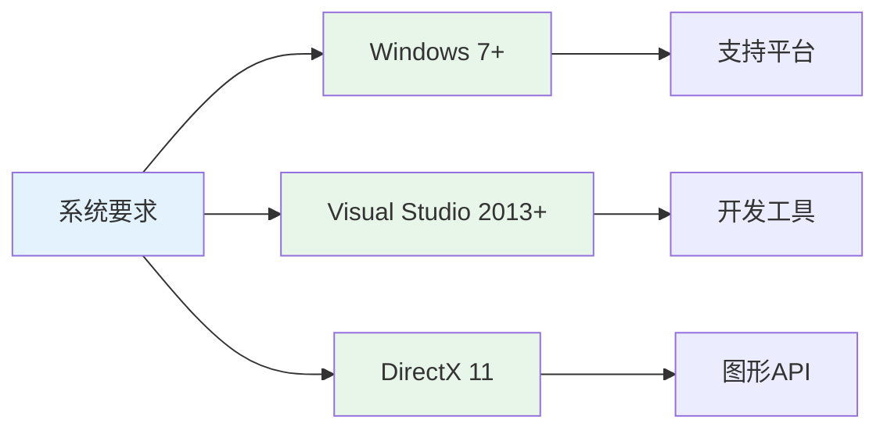

### 安装流程

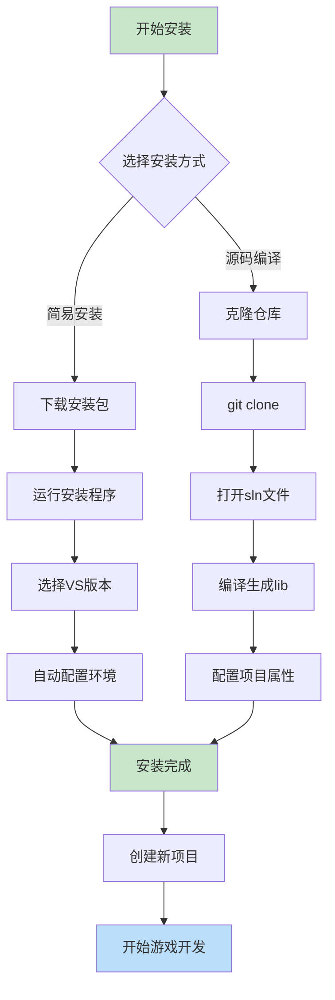

### 第一步：获取源码

```bash
# 克隆仓库
git clone https://github.com/nomango/easy2d.git

# 或者下载 ZIP 压缩包
# 访问 https://github.com/Easy2D/Easy2D/releases
```

### 第二步：编译引擎

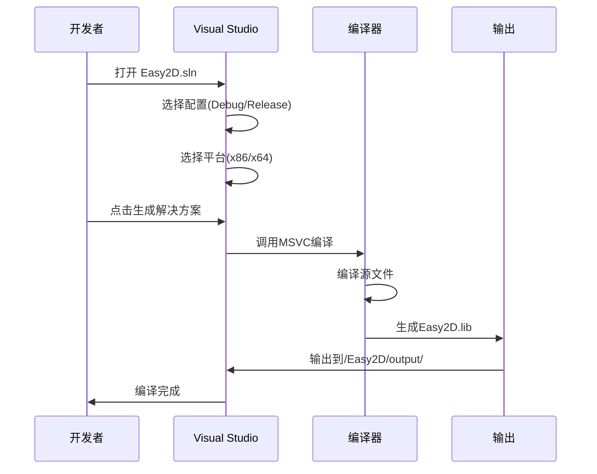

### 第三步：配置项目

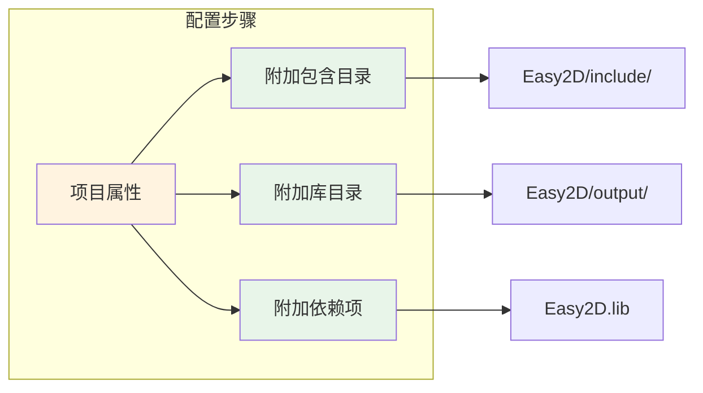

**详细配置：**

| 配置项 | 路径/值 |
|:---|:---|
| C/C++ → 附加包含目录 | `$(SolutionDir)../Easy2D/include/` |
| 链接器 → 附加库目录 | `$(SolutionDir)../Easy2D/output/` |
| 链接器 → 附加依赖项 | `Easy2D.lib` |

### 第四步：Hello World

```cpp
#include <easy2d/easy2d.h>

using namespace easy2d;

int main()
{
    // 初始化引擎
    if (Game::init())
    {
        // 创建场景
        auto scene = new Scene;
        
        // 创建精灵
        auto sprite = new Sprite("player.png");
        sprite->setPos(400, 300);
        scene->addChild(sprite);
        
        // 运行动画
        auto move = gcnew MoveBy(2, 200, 0);
        auto rotate = gcnew RotateBy(2, 360);
        sprite->runAction(gcnew Sequence({ move, rotate }));
        
        // 运行场景
        Director::getInstance()->runScene(scene);
        
        // 启动游戏循环
        Game::start();
    }
    
    Game::destroy();
    return 0;
}
```

---

## 📁 项目结构

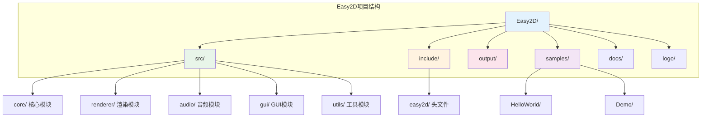

### 目录说明

```
Easy2D/
├── src/                    # 源代码
│   ├── core/              # 核心功能（场景、节点、导演）
│   ├── renderer/          # 渲染系统（精灵、纹理、文字）
│   ├── animation/         # 动画系统
│   ├── audio/             # 音频系统
│   ├── gui/               # GUI组件
│   └── utils/             # 工具类
├── include/               # 头文件
│   └── easy2d/
│       └── easy2d.h       # 主头文件
├── output/                # 编译输出（.lib文件）
├── samples/               # 示例项目
│   ├── HelloWorld/        # Hello World示例
│   └── Demo/              # 综合演示
├── docs/                  # 文档
└── logo/                  # Logo资源
```

---

## 🎮 核心概念

### 节点层级结构

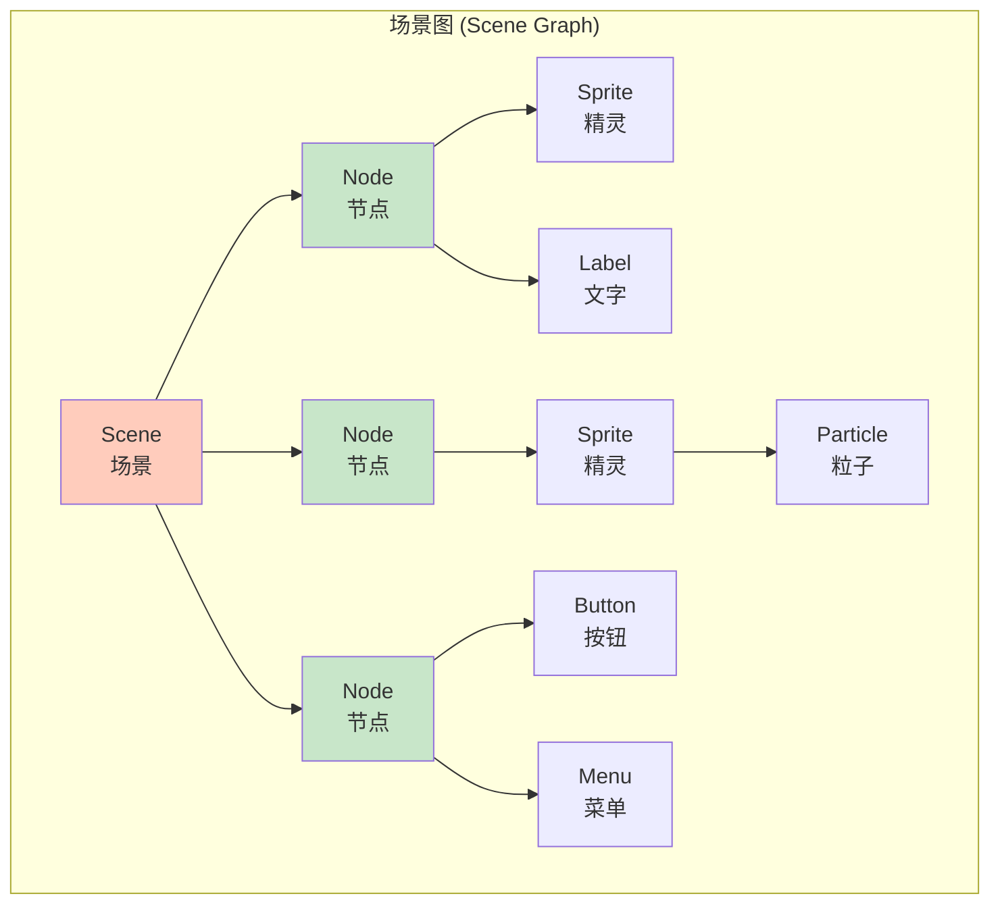

### 游戏循环

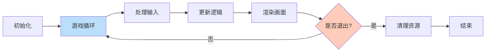

### 动画系统

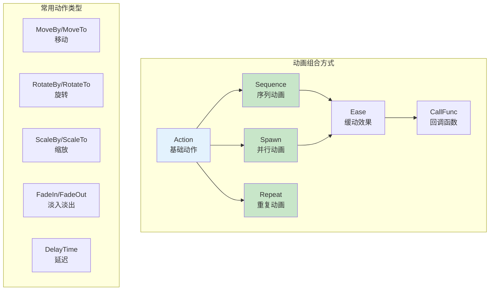

---

## 📚 示例代码

### 场景切换示例

```cpp
// 创建第一个场景
auto scene1 = new Scene;
auto label1 = new Label("场景 1");
label1->setPos(400, 300);
scene1->addChild(label1);

// 创建第二个场景
auto scene2 = new Scene;
auto label2 = new Label("场景 2");
label2->setPos(400, 300);
scene2->addChild(label2);

// 3秒后切换到场景2，使用淡入淡出效果
auto delay = gcnew DelayTime(3);
auto transition = gcnew TransitionFade(1, scene2);
auto sequence = gcnew Sequence({ delay, transition });
scene1->runAction(sequence);
```

### 动画组合示例

```cpp
// 创建一个复杂的动画序列
auto sprite = new Sprite("hero.png");

// 移动动画
auto move = gcnew MoveBy(1, 100, 0);
// 旋转动画
auto rotate = gcnew RotateBy(1, 180);
// 缩放动画
auto scale = gcnew ScaleTo(0.5, 1.5, 1.5);

// 并行动画（同时执行）
auto spawn = gcnew Spawn({ move, rotate });

// 序列动画（按顺序执行）
auto sequence = gcnew Sequence({ spawn, scale });

// 添加缓动效果
auto ease = gcnew EaseInOut(sequence);

// 无限循环
auto repeat = gcnew RepeatForever(ease);

sprite->runAction(repeat);
```

---

## 🔧 进阶主题

### 自定义节点

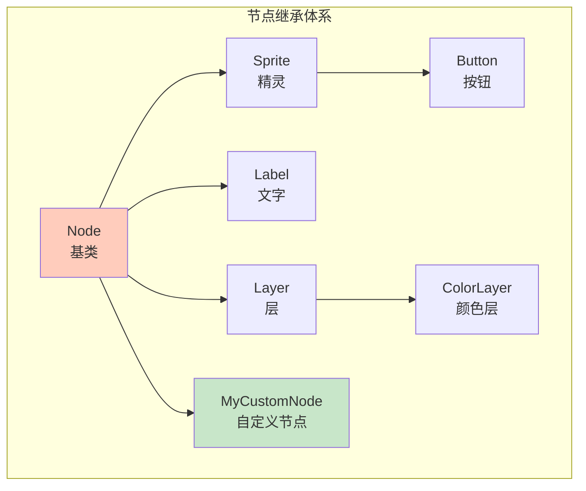

```cpp
class MyCustomNode : public Node
{
public:
    virtual void onUpdate() override
    {
        // 每帧更新逻辑
    }
    
    virtual void onRender() override
    {
        // 自定义渲染
    }
};
```

### 事件处理流程

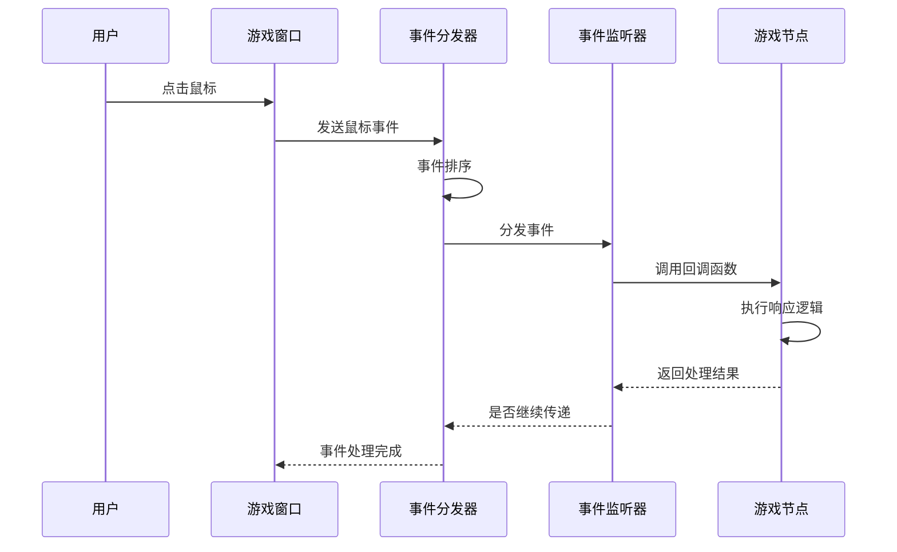

---

## 📖 学习资源

### 官方资源

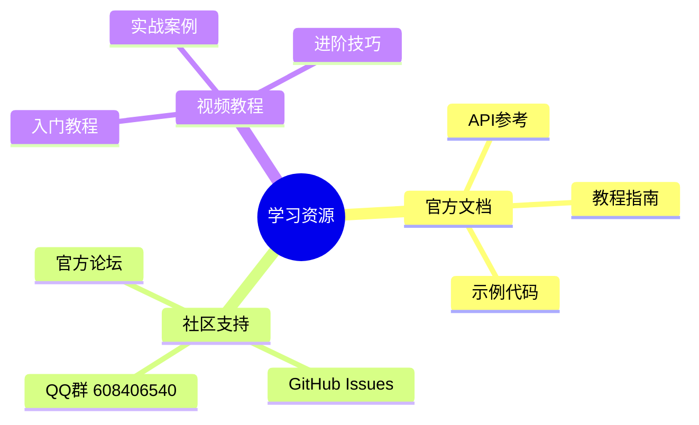

| 资源类型 | 链接 | 说明 |
|:---|:---|:---|
| 🌐 官方网站 | [easy2d.cn](https://easy2d.cn) | 完整文档和教程 |
| 📦 GitHub | [github.com/Easy2D/Easy2D](https://github.com/Easy2D/Easy2D) | 源码和发布版本 |
| 💬 QQ群 | 608406540 | 技术交流和答疑 |
| 📝 示例项目 | `/samples/` 目录 | 官方示例代码 |

---

## 🗺️ 路线图

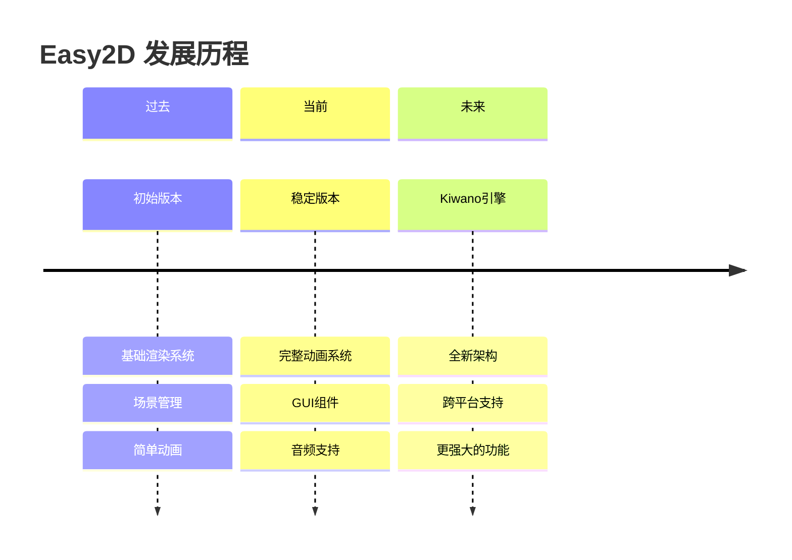

> ⚠️ **重要提示**：Easy2D 是作者个人的早期作品，目前处于维护状态。新的游戏引擎项目 [Kiwano](https://github.com/nomango/kiwano) 已经更加庞大且专业，建议关注新项目的发展。

---

## 🤝 贡献指南

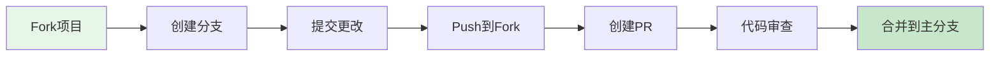

我们欢迎各种形式的贡献：
- 🐛 提交 Bug 报告
- 💡 提出新功能建议
- 📝 改进文档
- 🔧 提交代码修复
- 🎨 设计新示例

---

## 📄 许可证

```
MIT License

Copyright (c) 2018-2024 Easy2D Contributors

Permission is hereby granted, free of charge, to any person obtaining a copy
of this software and associated documentation files (the "Software"), to deal
in the Software without restriction, including without limitation the rights
to use, copy, modify, merge, publish, distribute, sublicense, and/or sell
copies of the Software, and to permit persons to whom the Software is
furnished to do so, subject to the following conditions:

The above copyright notice and this permission notice shall be included in all
copies or substantial portions of the Software.

THE SOFTWARE IS PROVIDED "AS IS", WITHOUT WARRANTY OF ANY KIND, EXPRESS OR
IMPLIED, INCLUDING BUT NOT LIMITED TO THE WARRANTIES OF MERCHANTABILITY,
FITNESS FOR A PARTICULAR PURPOSE AND NONINFRINGEMENT. IN NO EVENT SHALL THE
AUTHORS OR COPYRIGHT HOLDERS BE LIABLE FOR ANY CLAIM, DAMAGES OR OTHER
LIABILITY, WHETHER IN AN ACTION OF CONTRACT, TORT OR OTHERWISE, ARISING FROM,
OUT OF OR IN CONNECTION WITH THE SOFTWARE OR THE USE OR OTHER DEALINGS IN THE
SOFTWARE.
```

---

<div align="center">

### 🌟 如果这个项目对你有帮助，请给个 Star！

[](https://github.com/Easy2D/Easy2D/stargazers)

**Made with ❤️ by [Nomango](https://github.com/nomango)**

</div>
