<div align="center">


[](https://ci.appveyor.com/project/Nomango/easy2d/branch/master)
[](https://github.com/Easy2D/Easy2D/releases/latest)
[](https://github.com/Easy2D/Easy2D/blob/master/LICENSE)

</div>

---

## 📖 简介

> 🎮 **Easy2D** 是一个为 C++ 设计的轻量级 2D 游戏引擎，专注于简化游戏开发流程，让开发者能够快速构建 Windows 平台的 2D 游戏。

### 🎯 设计目标

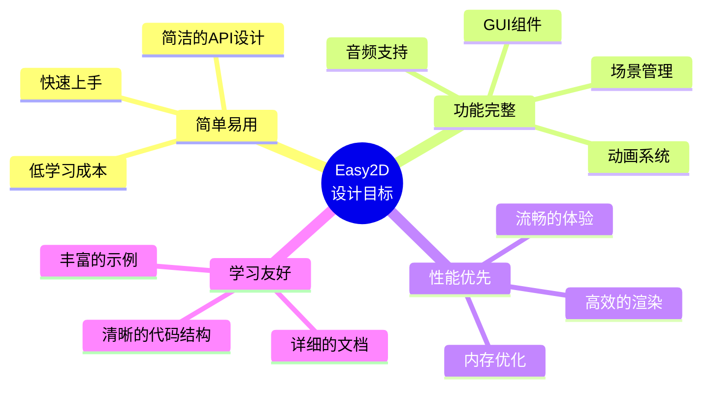

---

## 🏗️ 系统架构

### 核心架构图

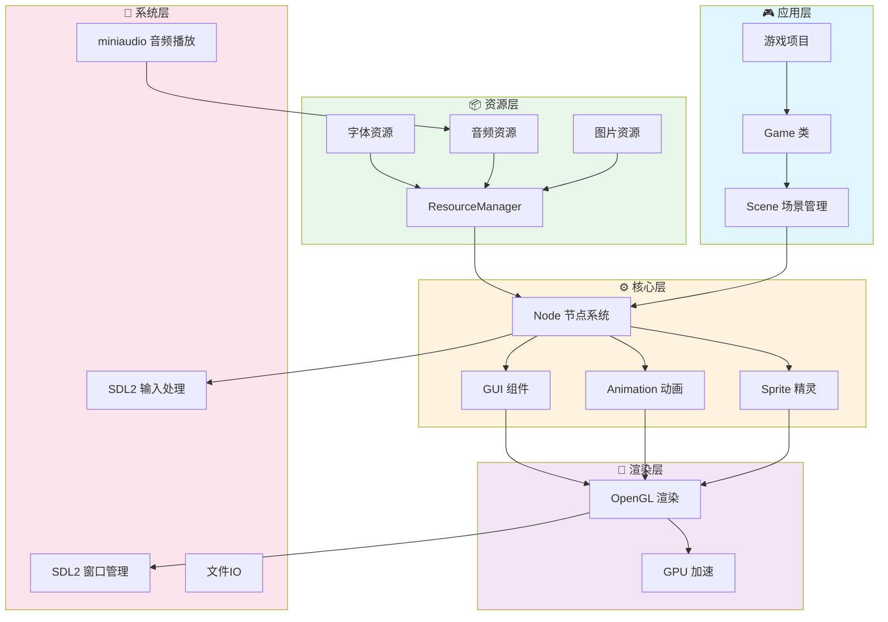

### 场景生命周期

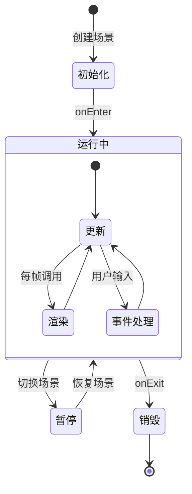

---

## ✨ 功能特性

### 功能全景图

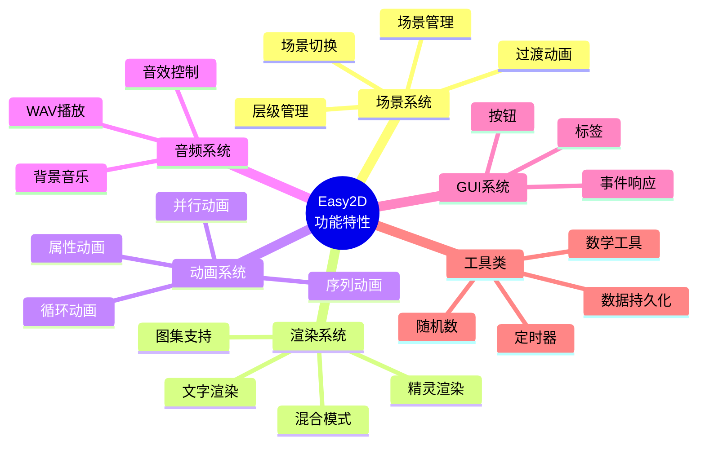

### 核心模块详解

| 模块 | 功能描述 | 关键类 |
|:---:|:---|:---|
| 🎬 **场景管理** | 多场景切换、过渡动画、层级控制 | `Scene`, `Director`, `Transition` |
| 🎨 **渲染系统** | 2D图形渲染、文字显示、纹理管理 | `Sprite`, `Label`, `Texture` |
| 🎭 **动画系统** | 属性动画、组合动画、缓动函数 | `Action`, `Animate`, `Ease` |
| 🔊 **音频系统** | WAV音频播放、音量控制 | `Audio`, `Music`, `SoundEffect` |
| 🖱️ **GUI系统** | 按钮、菜单、事件响应 | `Button`, `Menu`, `EventListener` |
| 💾 **数据存储** | 本地数据持久化、配置文件 | `UserDefault`, `FileUtils` |
| 📝 **日志系统** | 多级别日志、文件记录、调试输出 | `Logger`, `LogLevel` |

---

## 🚀 快速开始

### 环境要求

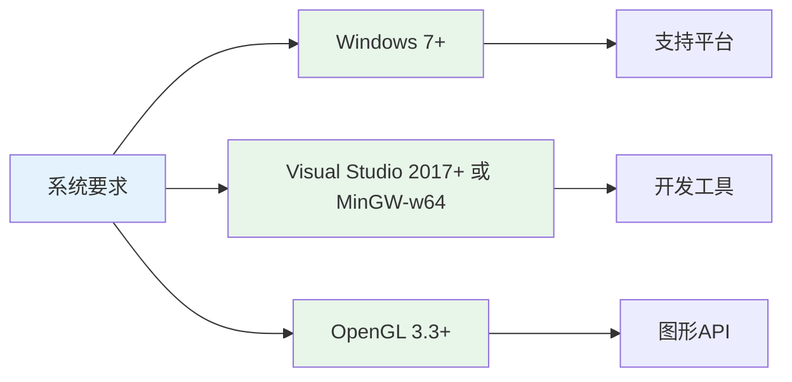

### 技术栈与依赖库

| 库名 | 版本 | 用途 | 说明 |
|:---:|:---:|:---|:---|
| **SDL2** | 2.x | 窗口管理、输入处理、事件系统 | 跨平台多媒体库 |
| **OpenGL** | 3.3+ | 2D图形渲染 | 硬件加速渲染 |
| **glad** | 最新 | OpenGL 加载器 | 管理 OpenGL 函数指针 |
| **FreeType** | 2.x | 字体渲染 | TrueType/OpenType 字体支持 |
| **stb** | 最新 | 图像加载 | stb_image 等单头文件库 |
| **miniaudio** | 最新 | 音频播放 | 跨平台音频库 |
| **zlib** | 1.3.1 | 数据压缩 | FreeType 依赖 |
| **spdlog** | 最新 | 日志系统 | 高性能 C++ 日志库 |

### 安装流程

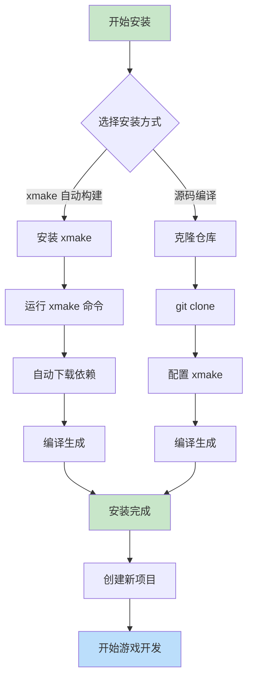

### 第一步：获取源码

```bash
# 克隆仓库
git clone https://github.com/nomango/easy2d.git

# 或者下载 ZIP 压缩包
# 访问 https://github.com/Easy2D/Easy2D/releases
```

### 第二步：安装 xmake

**Windows (PowerShell):**
```powershell
# 使用安装脚本
Invoke-Expression (Invoke-Webrequest 'https://xmake.io/psget.text' -UseBasicParsing).Content
```

**或者下载安装包:**
- 访问 https://xmake.io/#/zh-cn/guide/installation 下载安装程序

### 第三步：编译引擎

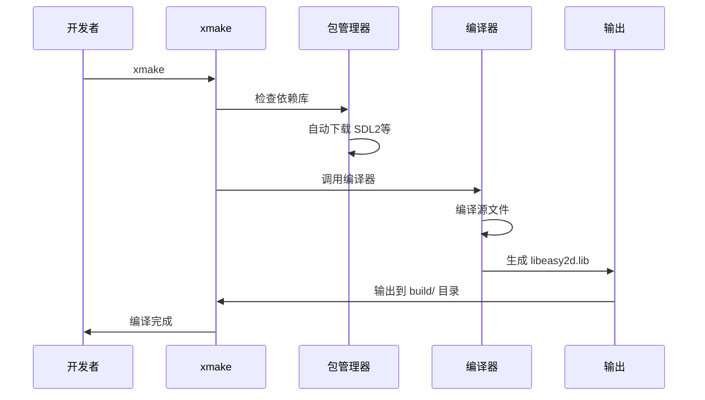

**编译命令:**

```bash
# 进入项目目录
cd Easy2D

# 默认编译 (Debug 模式)
xmake

# 编译 Release 版本
xmake -m release

# 指定编译器 (MSVC)
xmake f --toolchain=msvc
xmake

# 指定编译器 (MinGW)
xmake f --toolchain=mingw --mingw=/path/to/mingw
xmake

# 清理并重新编译
xmake clean
xmake

# 编译并运行演示程序
xmake -r
xmake run GreedyMonster
```

### 第四步：配置项目

**使用 xmake 创建新游戏项目:**

创建 `xmake.lua` 文件:

```lua
-- 我的游戏项目
set_project("MyGame")
set_version("1.0.0")
set_languages("c++17")

-- 添加依赖
add_requires("libsdl2", "glad", "freetype", "stb", "zlib")

-- 可执行文件目标
target("MyGame")
    set_kind("binary")
    add_files("src/*.cpp")
    add_includedirs("src")
    
    -- 添加 Easy2D 头文件路径
    add_includedirs("path/to/Easy2D/include")
    
    -- 添加依赖包
    add_packages("libsdl2", "glad", "freetype", "stb", "zlib")
    
    -- 链接 Easy2D 库
    add_linkdirs("path/to/Easy2D/build/windows/x64/release")
    add_links("libeasy2d")
    
    -- Windows 系统库
    if is_plat("windows") then
        add_syslinks("opengl32", "user32", "gdi32", "shell32")
    end
```

### 第五步：Hello World

```cpp
#include <easy2d/easy2d.h>

using namespace easy2d;

int main()
{
    // 初始化引擎
    if (Game::init())
    {
        // 创建场景
        auto scene = new Scene;
        
        // 创建精灵
        auto sprite = new Sprite("player.png");
        sprite->setPos(400, 300);
        scene->addChild(sprite);
        
        // 运行动画
        auto move = gcnew MoveBy(2, 200, 0);
        auto rotate = gcnew RotateBy(2, 360);
        sprite->runAction(gcnew Sequence({ move, rotate }));
        
        // 运行场景
        Director::getInstance()->runScene(scene);
        
        // 启动游戏循环
        Game::start();
    }
    
    Game::destroy();
    return 0;
}
```

---

## 🔧 编译器支持

### MSVC (Visual Studio)

**支持的版本:**
- Visual Studio 2017 (15.0+)
- Visual Studio 2019 (16.0+)
- Visual Studio 2022 (17.0+)

**环境配置:**

1. **安装 Visual Studio**
   - 下载地址: https://visualstudio.microsoft.com/
   - 安装 "使用 C++ 的桌面开发" 工作负载

2. **安装 xmake**
   ```powershell
   Invoke-Expression (Invoke-Webrequest 'https://xmake.io/psget.text' -UseBasicParsing).Content
   ```

3. **编译项目**
   ```bash
   # 使用默认 MSVC 工具链
   xmake f -c
   xmake
   
   # 指定 VS 版本 (可选)
   xmake f --vs=2022
   xmake
   ```

**MSVC 特定配置:**

```lua
-- xmake.lua 中 MSVC 配置
if is_plat("windows") then
    -- 设置为 Windows 子系统 (GUI 程序)
    add_ldflags("/SUBSYSTEM:WINDOWS", {force = true})
    -- 设置入口点
    add_ldflags("/ENTRY:WinMainCRTStartup", {force = true})
    -- 启用多处理器编译
    add_cxxflags("/MP", {force = true})
    -- UTF-8 编码支持
    add_cxxflags("/source-charset:utf-8", {force = true})
    add_cxxflags("/execution-charset:utf-8", {force = true})
end
```

### MinGW-w64

**支持的版本:**
- MinGW-w64 8.0+
- GCC 8.0+

**环境配置:**

1. **安装 MinGW-w64**
   - 推荐: MSYS2 (https://www.msys2.org/)
   ```bash
   # 安装基础开发工具
   pacman -S base-devel mingw-w64-x86_64-toolchain
   ```

2. **配置环境变量**
   - 将 `C:\msys64\mingw64\bin` 添加到 PATH

3. **编译项目**
   ```bash
   # 配置 MinGW 工具链
   xmake f --toolchain=mingw --mingw=C:/msys64/mingw64
   xmake
   ```

**MinGW 特定配置:**

```lua
-- xmake.lua 中 MinGW 配置
if is_plat("mingw") then
    -- 启用所有警告
    add_cxxflags("-Wall", "-Wextra", "-Wpedantic", {force = true})
    -- UTF-8 编码支持
    add_cxxflags("-finput-charset=UTF-8", {force = true})
    add_cxxflags("-fexec-charset=UTF-8", {force = true})
end
```

### 编译配置对比

| 配置项 | MSVC | MinGW |
|:---:|:---:|:---:|
| **工具链** | `msvc` | `mingw` |
| **C++ 标准** | `/std:c++17` | `-std=c++17` |
| **警告级别** | `/W3` | `-Wall -Wextra` |
| **多线程编译** | `/MP` | `-jN` |
| **UTF-8 编码** | `/source-charset:utf-8` | `-finput-charset=UTF-8` |
| **调试信息** | `/Zi` | `-g` |
| **优化级别** | `/O2` | `-O3` |

---

## 📁 项目结构

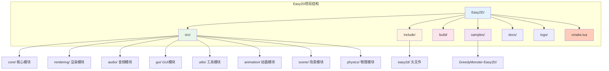

### 目录说明

```
Easy2D/
├── Easy2D/
│   ├── src/                    # 源代码
│   │   ├── Core/              # 核心功能（场景、节点、导演、窗口）
│   │   ├── Rendering/         # 渲染系统（OpenGL、精灵、纹理、文字）
│   │   ├── Animation/         # 动画系统
│   │   ├── Resources/         # 资源管理（图片、音频、字体）
│   │   ├── Scene/             # 场景和节点
│   │   ├── Utils/             # 工具类
│   │   └── Physics/           # 物理系统
│   └── include/               # 头文件
│       └── easy2d/
│           └── easy2d.h       # 主头文件
├── GreedyMonster-Easy2D/      # 演示游戏项目
│   ├── src/                   # 演示程序源码
│   └── xmake.lua              # 演示程序构建配置
├── build/                     # 编译输出目录 (自动生成)
├── docs/                      # 文档
├── logo/                      # Logo资源
└── xmake.lua                  # 主构建配置文件
```

---

## 🎮 核心概念

### 节点层级结构

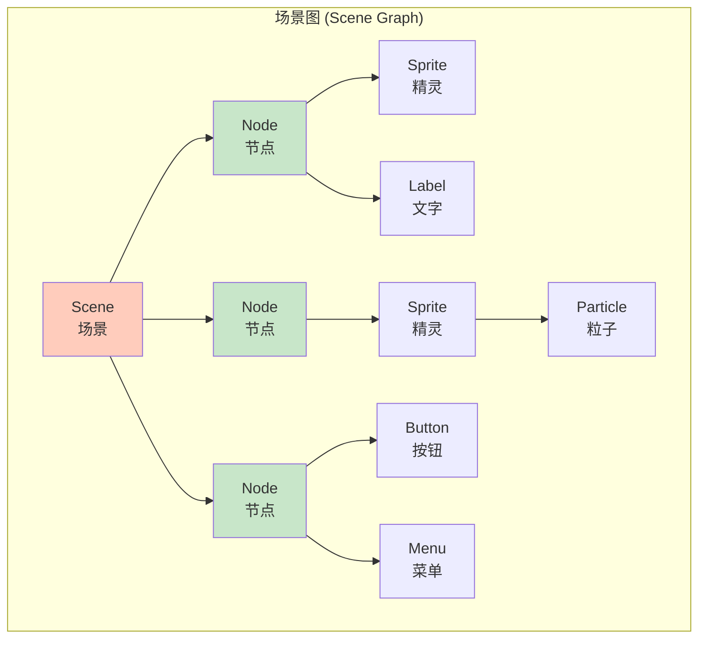

### 游戏循环

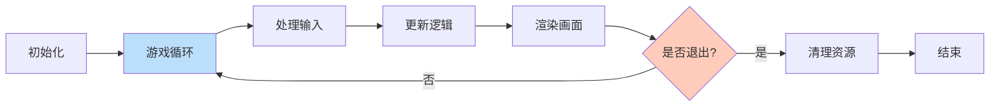

### 动画系统

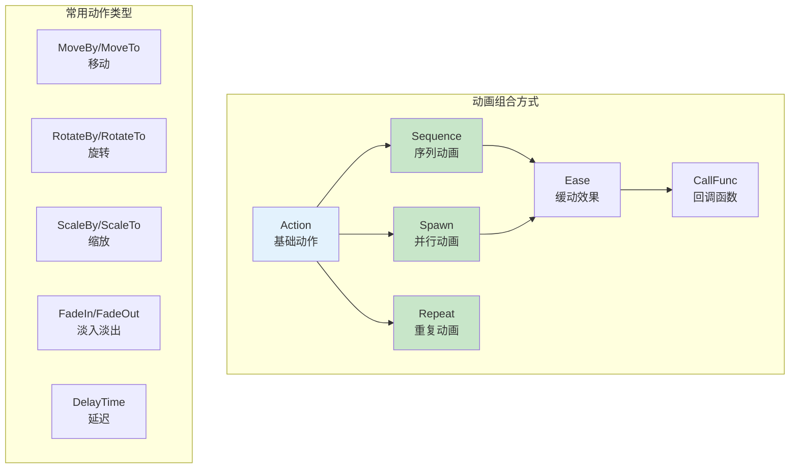

---

## 📚 示例代码

### 场景切换示例

```cpp
// 创建第一个场景
auto scene1 = new Scene;
auto label1 = new Label("场景 1");
label1->setPos(400, 300);
scene1->addChild(label1);

// 创建第二个场景
auto scene2 = new Scene;
auto label2 = new Label("场景 2");
label2->setPos(400, 300);
scene2->addChild(label2);

// 3秒后切换到场景2，使用淡入淡出效果
auto delay = gcnew DelayTime(3);
auto transition = gcnew TransitionFade(1, scene2);
auto sequence = gcnew Sequence({ delay, transition });
scene1->runAction(sequence);
```

### 动画组合示例

```cpp
// 创建一个复杂的动画序列
auto sprite = new Sprite("hero.png");

// 移动动画
auto move = gcnew MoveBy(1, 100, 0);
// 旋转动画
auto rotate = gcnew RotateBy(1, 180);
// 缩放动画
auto scale = gcnew ScaleTo(0.5, 1.5, 1.5);

// 并行动画（同时执行）
auto spawn = gcnew Spawn({ move, rotate });

// 序列动画（按顺序执行）
auto sequence = gcnew Sequence({ spawn, scale });

// 添加缓动效果
auto ease = gcnew EaseInOut(sequence);

// 无限循环
auto repeat = gcnew RepeatForever(ease);

sprite->runAction(repeat);
```

---

## 🔧 进阶主题

### 日志系统

Easy2D 集成了 **spdlog** 作为日志后端，提供高性能、功能丰富的日志记录功能。

#### 日志级别

| 级别 | 宏 | 说明 | 输出位置 |
|:---:|:---|:---|:---|
| Trace | `E2D_TRACE` | 最详细的追踪信息 | 仅Debug模式 |
| Debug | `E2D_DEBUG_LOG` | 调试信息 | 仅Debug模式 |
| Info | `E2D_LOG` | 普通信息 | 仅Debug模式 |
| Warning | `E2D_WARNING` | 警告信息 | 控制台+文件 |
| Error | `E2D_ERROR` | 错误信息 | 控制台+文件 |
| Critical | `E2D_CRITICAL` | 严重错误 | 控制台+文件 |

#### 使用示例

```cpp
// 追踪信息（仅Debug模式输出）
E2D_TRACE("Entering function: %s", __FUNCTION__);

// 调试信息（仅Debug模式输出）
E2D_DEBUG_LOG("Player position: x=%f, y=%f", x, y);

// 普通信息（仅Debug模式输出）
E2D_LOG("Game initialized successfully");

// 警告信息（始终输出）
E2D_WARNING("Texture not found: %s", textureName);

// 错误信息（始终输出）
E2D_ERROR("Failed to load shader");

// 严重错误（始终输出）
E2D_CRITICAL("Out of memory!");

// 断言（仅Debug模式）
E2D_ASSERT(ptr != nullptr, "Pointer should not be null");

// 运行时设置日志级别
Logger::setLevel(LogLevel::Warn);  // 只显示警告及以上
```

#### 日志输出

日志同时输出到以下位置：
- **控制台窗口**：彩色输出，带时间戳
- **日志文件**：`logs/easy2d.log`，自动轮转（5MB分割，保留3个备份）
- **VS调试窗口**：在Visual Studio中调试时可见

#### 日志格式

```
[2024-01-15 10:30:25.123] [info] Easy2D Game initializing...
[2024-01-15 10:30:25.456] [warn] Texture not found: player.png
[2024-01-15 10:30:25.789] [error] Shader compilation failed
```

### 自定义节点

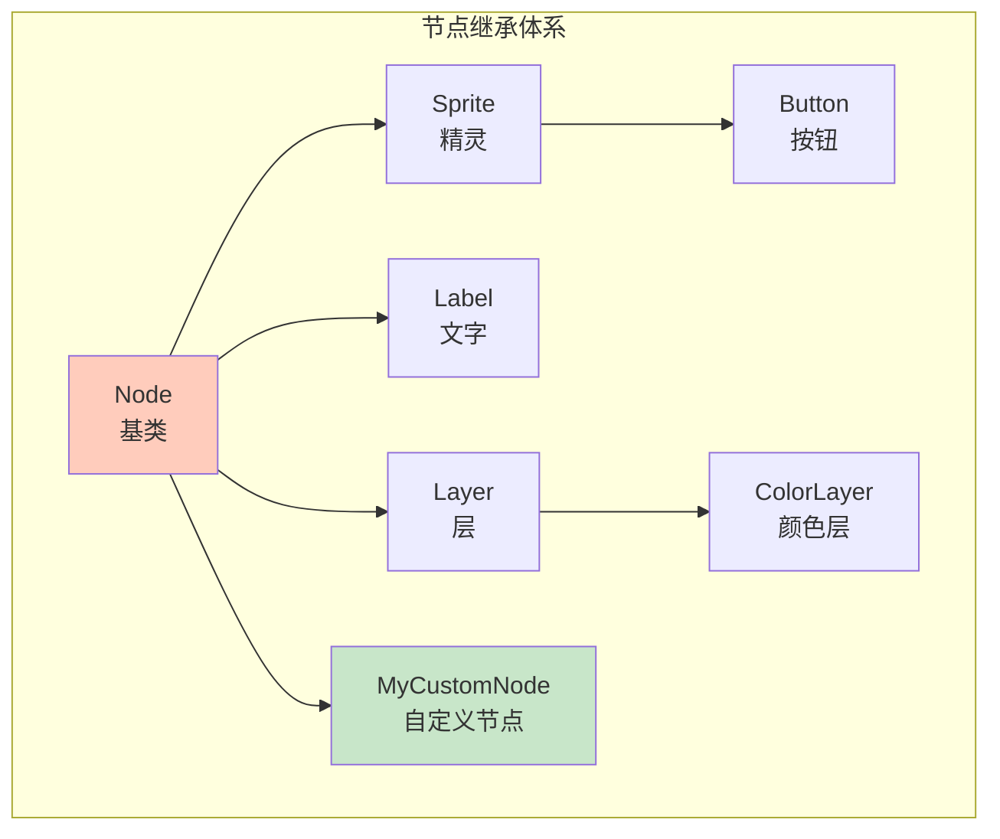

```cpp
class MyCustomNode : public Node
{
public:
    virtual void onUpdate() override
    {
        // 每帧更新逻辑
    }
    
    virtual void onRender() override
    {
        // 自定义渲染
    }
};
```

### 事件处理流程


---

## 📖 学习资源

### 官方资源

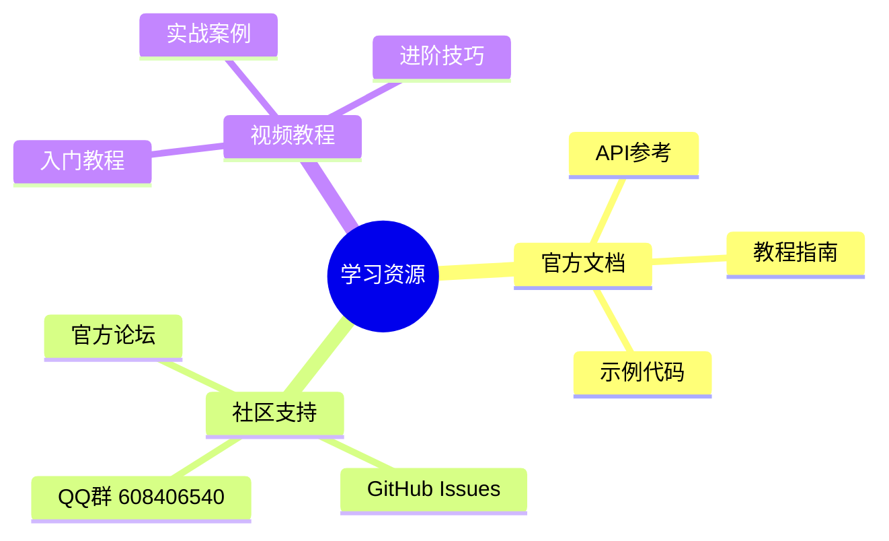

| 资源类型 | 链接 | 说明 |
|:---|:---|:---|
| 🌐 官方网站 | [easy2d.cn](https://easy2d.cn) | 完整文档和教程 |
| 📦 GitHub | [github.com/Easy2D/Easy2D](https://github.com/Easy2D/Easy2D) | 源码和发布版本 |
| 💬 QQ群 | 608406540 | 技术交流和答疑 |
| 📝 示例项目 | `/GreedyMonster-Easy2D/` 目录 | 官方示例游戏 |

---

## 🗺️ 路线图

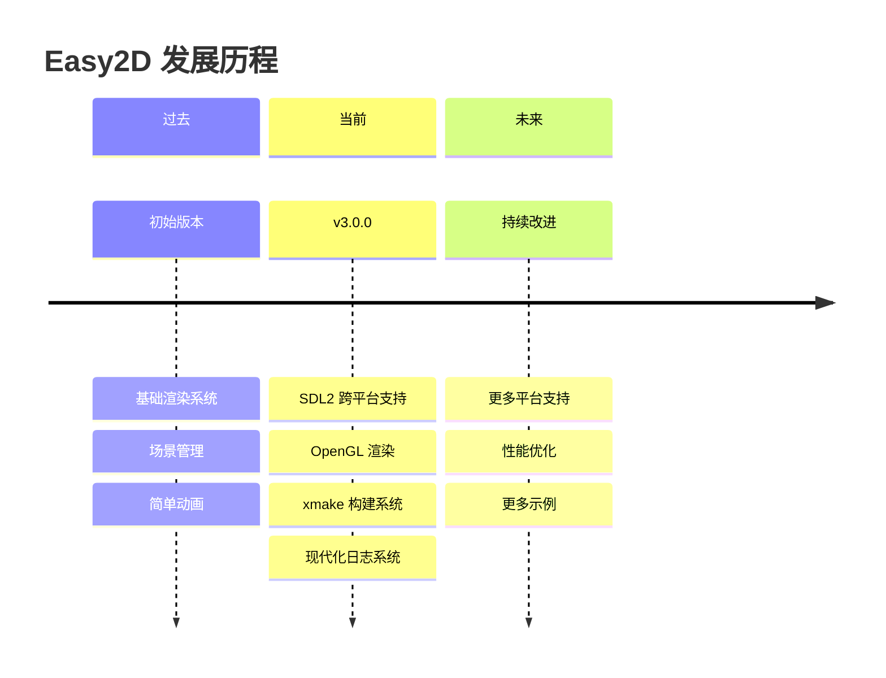

> ⚠️ **重要提示**：Easy2D 是作者个人的早期作品，目前处于维护状态。新的游戏引擎项目 [Kiwano](https://github.com/nomango/kiwano) 已经更加庞大且专业，建议关注新项目的发展。

---

## 🤝 贡献指南

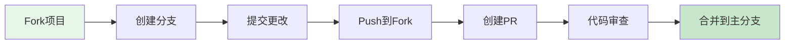

我们欢迎各种形式的贡献：
- 🐛 提交 Bug 报告
- 💡 提出新功能建议
- 📝 改进文档
- 🔧 提交代码修复
- 🎨 设计新示例

---

## 📄 许可证

```
MIT License

Copyright (c) 2018-2024 Easy2D Contributors

Permission is hereby granted, free of charge, to any person obtaining a copy
of this software and associated documentation files (the "Software"), to deal
in the Software without restriction, including without limitation the rights
to use, copy, modify, merge, publish, distribute, sublicense, and/or sell
copies of the Software, and to permit persons to whom the Software is
furnished to do so, subject to the following conditions:

The above copyright notice and this permission notice shall be included in all
copies or substantial portions of the Software.

THE SOFTWARE IS PROVIDED "AS IS", WITHOUT WARRANTY OF ANY KIND, EXPRESS OR
IMPLIED, INCLUDING BUT NOT LIMITED TO THE WARRANTIES OF MERCHANTABILITY,
FITNESS FOR A PARTICULAR PURPOSE AND NONINFRINGEMENT. IN NO EVENT SHALL THE
AUTHORS OR COPYRIGHT HOLDERS BE LIABLE FOR ANY CLAIM, DAMAGES OR OTHER
LIABILITY, WHETHER IN AN ACTION OF CONTRACT, TORT OR OTHERWISE, ARISING FROM,
OUT OF OR IN CONNECTION WITH THE SOFTWARE OR THE USE OR OTHER DEALINGS IN THE
SOFTWARE.
```

---

<div align="center">

### 🌟 如果这个项目对你有帮助，请给个 Star！

[](https://github.com/Easy2D/Easy2D/stargazers)

**Made with ❤️ by [Nomango](https://github.com/nomango)**

</div>
