<div align="center">


<p align="center">
  <a href="https://github.com/Easy2D/Easy2D/releases/latest">
    
  </a>
  <a href="https://github.com/Easy2D/Easy2D/blob/master/LICENSE">
    
  </a>
  <a href="https://ci.appveyor.com/project/Nomango/easy2d/branch/master">
    
  </a>
  <a href="#">
    
  </a>
  <a href="#">
    
  </a>
  <a href="#">
    
  </a>
</p>

<p align="center">
  <b>🎮 为 C++ 打造的轻量级 2D 游戏引擎</b><br>
  <i>简单、高效、跨编译器支持</i>
</p>

[📖 官方文档](https://easy2d.cn) | [🚀 快速开始](#快速开始) | [📦 下载安装](#安装) | [💬 QQ群: 608406540](#联系方式)

</div>

---

## 🌟 简介

**Easy2D** 是一个专为 C++ 设计的轻量级 2D 游戏引擎，目前支持 Windows 平台。

> 💡 创建这个引擎的初衷是学习游戏引擎技术，并开发一些有趣的小游戏。Easy2D 提供了丰富的工具和轮子，让游戏开发变得简单而愉快。

---

## 🗺️ 架构概览

```mermaid
mindmap
  root((Easy2D 引擎架构))
    核心系统
      游戏循环 Game
      渲染系统 Renderer
      窗口管理 Window
      时间管理 Time
      输入处理 Input
      垃圾回收 GC
      日志系统 Logger
    场景管理
      场景 Scene
      场景管理器 SceneManager
      过渡动画 Transition
        淡入淡出 Fade
        移动过渡 Move
        盒子过渡 Box
    节点系统
      基础节点 Node
      精灵 Sprite
      文本 Text
      画布 Canvas
      形状 ShapeNode
      场景 Scene
    动画系统
      动作基类 Action
      位移动作 MoveBy/MoveTo
      缩放动作 ScaleBy/ScaleTo
      旋转动作 RotateBy/RotateTo
      透明度动作 OpacityBy/OpacityTo
      跳跃动作 JumpBy/JumpTo
      帧动画 Animation
      组合动作 Sequence/Spawn/Loop
    事件系统
      监听器 Listener
      按钮监听器 ButtonListener
    工具库
      音乐播放 Music
      数据持久化 Data
      随机数 Random
      定时器 Timer
      路径处理 Path
    数学库
      点 Point
      向量 Vector2
      矩形 Rect
      大小 Size
      矩阵 Matrix
      颜色 Color
```



---

## ✨ 功能特性

### 🎬 核心功能

| 功能模块 | 描述 | 状态 |
|:--------:|:-----|:----:|
| 🎭 场景管理 | 灵活的场景切换与管理 | ✅ |
| 🎨 过渡动画 | 淡入淡出、移动、盒子等多种过渡效果 | ✅ |
| 🎬 动画系统 | 丰富的动作和帧动画支持 | ✅ |
| 🔘 GUI 系统 | 简单易用的按钮组件 | ✅ |
| 🎵 音频支持 | WAV 格式音频播放 | ✅ |
| 💾 数据持久化 | 游戏数据保存与读取 | ✅ |
| 📝 日志系统 | 基于 spdlog 的高性能日志 | ✅ |

### 🎯 动作系统详解

```mermaid
flowchart TB
    subgraph 基础动作
        A[Action 基类]
        B[FiniteTimeAction 持续动作]
    end
    
    subgraph 变换动作
        C[MoveBy/MoveTo 位移]
        D[ScaleBy/ScaleTo 缩放]
        E[RotateBy/RotateTo 旋转]
        F[OpacityBy/OpacityTo 透明度]
        G[JumpBy/JumpTo 跳跃]
    end
    
    subgraph 复合动作
        H[Sequence 顺序执行]
        I[Spawn 同步执行]
        J[Loop 循环执行]
        K[Delay 延时]
        L[CallFunc 回调]
    end
    
    subgraph 动画
        M[Animation 帧动画]
        N[FrameSequence 帧序列]
        O[KeyFrame 关键帧]
    end
    
    A --> B
    B --> C & D & E & F & G
    A --> H & I & J & K & L
    A --> M
    M --> N
    N --> O
```

### 🖼️ 渲染流程


---

## 🚀 快速开始

### 环境要求

| 组件 | 最低版本 | 推荐版本 |
|:----:|:--------:|:--------:|
| Windows | Windows 7 | Windows 10/11 |
| Visual Studio | 2013 | 2022 |
| MinGW-w64 | 8.1.0 | 最新版 |
| C++ 标准 | C++11 | C++17 |

### 编译器支持

```mermaid
flowchart TD
    A[Easy2D 编译选项] --> B[MSVC]
    A --> C[Clang-CL]
    A --> D[MinGW-w64]
    
    B --> B1[Visual Studio 2013+]
    B --> B2[Visual Studio 2022]
    
    C --> C1[LLVM/Clang]
    
    D --> D1[x86_64-w64-mingw32]
    D --> D2[支持 UTF-8 编码]
    D --> D3[完整异常处理]
    
    style D fill:#ffa502,color:#fff
```



### 方式一：使用 Visual Studio

#### 步骤 1: 克隆仓库

```bash
git clone https://github.com/nomango/easy2d.git
cd easy2d
```

#### 步骤 2: 打开项目

使用 **Visual Studio 2013 或更高版本** 打开目录下的 `sln` 文件。

#### 步骤 3: 编译运行

直接运行项目，编译完成后会自动打开 Hello World 程序 🎉

### 方式二：使用 MinGW (🆕 新增支持)

#### 步骤 1: 安装依赖

确保已安装 [xmake](https://xmake.io) 构建工具：

```bash
# Windows 使用 PowerShell
Invoke-Expression (Invoke-Webrequest 'https://xmake.io/psget.text' -UseBasicParsing).Content
```

#### 步骤 2: 使用 MinGW 编译

```bash
# 克隆仓库
git clone https://github.com/nomango/easy2d.git
cd easy2d

# 使用 MinGW 工具链编译
xmake f --toolchain=mingw --mode=release
xmake

# 运行示例游戏
xmake run GreedyMonster
```

#### MinGW 编译选项说明

```bash
# 配置编译选项
xmake f --toolchain=mingw          # 使用 MinGW 工具链
xmake f --toolchain=msvc           # 使用 MSVC 工具链（默认）
xmake f --toolchain=clang-cl       # 使用 Clang-CL 工具链

# 切换构建模式
xmake f --mode=debug               # 调试模式
xmake f --mode=release             # 发布模式

# 清理并重新编译
xmake clean
xmake -r
```

### 方式三：使用 xmake (推荐)

```bash
# 使用默认工具链（自动检测）
xmake

# 运行游戏
xmake run GreedyMonster
```

---

## 📦 安装

### 简易安装器

简易安装器是一个使用 7zip 制作的自解压安装包，包含各 Visual Studio 版本预先编译好的库文件。

👉 前往 [GitHub Releases](https://github.com/Easy2D/Easy2D/releases/latest) 或 [Easy2D 官网](https://easy2d.cn) 下载最新安装程序。

### 从源代码安装

#### Visual Studio 项目配置

1. 编译 Easy2D 工程，生成 `.lib` 文件到 `/Easy2D/output/` 目录
2. 在你的项目中设置：
   - **C/C++** → **附加包含目录**: `$(Easy2DPath)/Easy2D/include/`
   - **链接器** → **附加库目录**: `$(Easy2DPath)/Easy2D/output/`

#### MinGW 项目配置

```makefile
# Makefile 示例
CXX = g++
CXXFLAGS = -std=c++17 -I/path/to/easy2d/Easy2D/include
LDFLAGS = -L/path/to/easy2d/build -leasy2d \
          -lopengl32 -luser32 -lgdi32 -lshell32 \
          -lwinmm -limm32 -lversion -lole32 \
          -lcomdlg32 -ldinput8 -ld2d1 -ldwrite -ldxguid

mygame: main.cpp
    $(CXX) $(CXXFLAGS) -o $@ $< $(LDFLAGS)
```

---

## 📝 Hello World 示例

```cpp
#include <easy2d/easy2d.h>

using namespace easy2d;

int main()
{
    // 初始化游戏窗口
    if (Game::init("Hello Easy2D", 800, 600))
    {
        // 创建场景
        auto scene = new Scene;
        
        // 创建文本节点
        auto text = new Text("Hello, Easy2D!");
        text->setPos(400, 300);
        text->setAnchor(0.5f, 0.5f);
        text->setFillColor(Color::Orange);
        
        // 添加动画效果
        text->runAction(new Loop(
            new Sequence({
                new ScaleTo(1.0f, 1.5f),
                new ScaleTo(1.0f, 1.0f)
            })
        ));
        
        // 添加到场景
        scene->addChild(text);
        
        // 启动场景
        SceneManager::enter(scene);
        
        // 开始游戏循环
        Game::start(60);  // 60 FPS
    }
    
    Game::destroy();
    return 0;
}
```

---

## 🏗️ 项目结构

```
Easy2D/
├── 📁 Easy2D/                    # 引擎核心代码
│   ├── 📁 include/               # 头文件
│   │   ├── 📁 easy2d/            # 引擎头文件
│   │   │   ├── easy2d.h          # 主头文件
│   │   │   ├── e2daction.h       # 动作系统
│   │   │   ├── e2dbase.h         # 基础系统
│   │   │   ├── e2dnode.h         # 节点系统
│   │   │   ├── e2dcommon.h       # 通用工具
│   │   │   ├── e2dmath.h         # 数学库
│   │   │   ├── e2dtool.h         # 工具库
│   │   │   └── ...
│   │   └── 📁 spdlog/            # 日志库
│   └── 📁 src/                   # 源文件
│       ├── 📁 Action/            # 动作系统实现
│       ├── 📁 Base/              # 基础系统实现
│       ├── 📁 Node/              # 节点系统实现
│       ├── 📁 Manager/           # 管理器实现
│       ├── 📁 Math/              # 数学库实现
│       ├── 📁 Tool/              # 工具库实现
│       └── 📁 Transition/        # 过渡动画实现
├── 📁 logo/                      # Logo 资源
├── 📁 scripts/                   # 构建脚本
├── 📄 xmake.lua                  # xmake 构建配置
├── 📄 LICENSE                    # MIT 许可证
└── 📄 README.md                  # 本文件
```

---

## 🛠️ 技术栈

| 技术 | 用途 | 版本 |
|:----:|:-----|:----:|
| Direct2D | 2D 图形渲染 | Windows SDK |
| DirectWrite | 文本渲染 | Windows SDK |
| DirectInput | 输入处理 | 8.0 |
| miniaudio | 音频播放 | 最新版 |
| spdlog | 日志系统 | 最新版 |
| xmake | 构建系统 | 2.5+ |

---

## 📋 API 速查

### 游戏控制

| 方法 | 说明 |
|:-----|:-----|
| `Game::init(title, w, h)` | 初始化游戏 |
| `Game::start(fps)` | 启动游戏循环 |
| `Game::pause()` | 暂停游戏 |
| `Game::resume()` | 恢复游戏 |
| `Game::quit()` | 退出游戏 |

### 场景管理

| 方法 | 说明 |
|:-----|:-----|
| `SceneManager::enter(scene)` | 进入场景 |
| `SceneManager::replace(scene)` | 替换场景 |
| `SceneManager::back()` | 返回上一场景 |

### 节点操作

| 方法 | 说明 |
|:-----|:-----|
| `node->setPos(x, y)` | 设置位置 |
| `node->setScale(sx, sy)` | 设置缩放 |
| `node->setRotation(angle)` | 设置旋转 |
| `node->setOpacity(value)` | 设置透明度 |
| `node->runAction(action)` | 运行动作 |

---

## 🗓️ 开发计划

> ⚠️ **注意**: Easy2D 是作者的早期作品，新的游戏引擎项目 [Kiwano](https://github.com/nomango/kiwano) 已经更加专业和庞大。

### 已完成 ✅
- [x] 基础渲染系统
- [x] 场景管理系统
- [x] 动画系统
- [x] 音频播放
- [x] GUI 组件
- [x] MinGW 编译器支持
- [x] xmake 构建系统

### 计划中 📋
- [ ] 更多平台支持
- [ ] 物理引擎集成
- [ ] 粒子系统
- [ ] 瓦片地图支持

---

## 🤝 贡献指南

欢迎提交 Issue 和 Pull Request！

1. Fork 本仓库
2. 创建特性分支 (`git checkout -b feature/AmazingFeature`)
3. 提交更改 (`git commit -m 'Add some AmazingFeature'`)
4. 推送到分支 (`git push origin feature/AmazingFeature`)
5. 打开 Pull Request

---

## 📞 联系方式

<div align="center">

| 渠道 | 链接 |
|:----:|:-----|
| 🌐 官网 | [easy2d.cn](https://easy2d.cn) |
| 💬 QQ群 | 608406540 |
| 🐙 GitHub | [github.com/Easy2D/Easy2D](https://github.com/Easy2D/Easy2D) |
| 📧 作者 | [Kiwano 引擎](https://github.com/nomango/kiwano) |

</div>

---

## 📄 许可证

本项目基于 [MIT](LICENSE) 许可证开源。

```
MIT License

Copyright (c) 2020 Haibo

Permission is hereby granted, free of charge, to any person obtaining a copy
of this software and associated documentation files (the "Software"), to deal
in the Software without restriction, including without limitation the rights
to use, copy, modify, merge, publish, distribute, sublicense, and/or sell
copies of the Software, and to permit persons to whom the Software is
furnished to do so, subject to the following conditions:

The above copyright notice and this permission notice shall be included in all
copies or substantial portions of the Software.
```

---

<div align="center">

**⭐ 如果这个项目对你有帮助，请给它一个 Star！**

Made with ❤️ by [Nomango](https://github.com/nomango)

</div>
